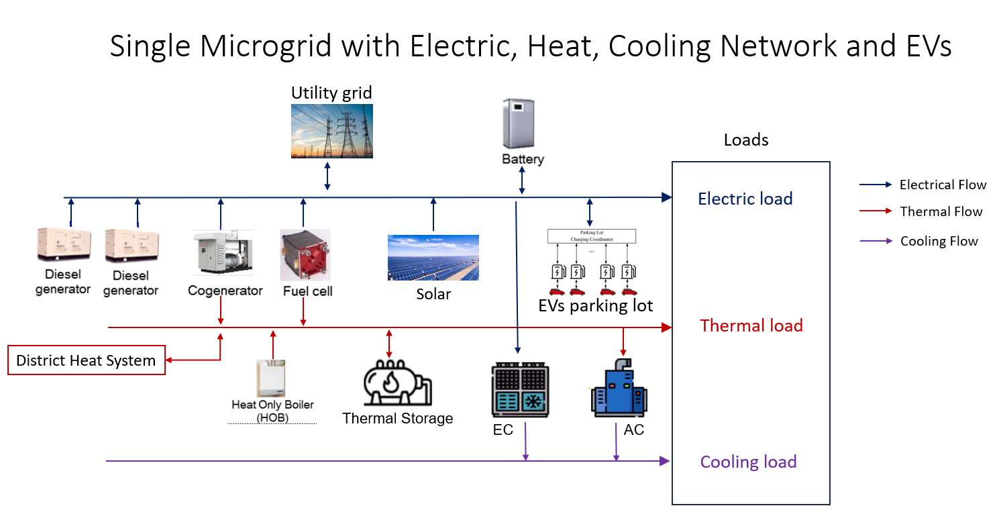

# MicrogridOptimization

### References:
- LP-based Mathematical Model for Optimal Microgrid Operation Considering Heat Trade with District Heat System, https://gvpress.com/journals/IJEIC/vol4_no4/2.pdf
- Optimal Operation of Networked Microgrids for Enhancing Resilience Using Mobile Electric Vehicles, https://www.mdpi.com/1996-1073/14/1/142
- Optimal scheduling of combined cooling, heating, and power system-based microgrid coupled with carbon capture storage system https://www.sciencedirect.com/science/article/abs/pii/S2352152X23001433
